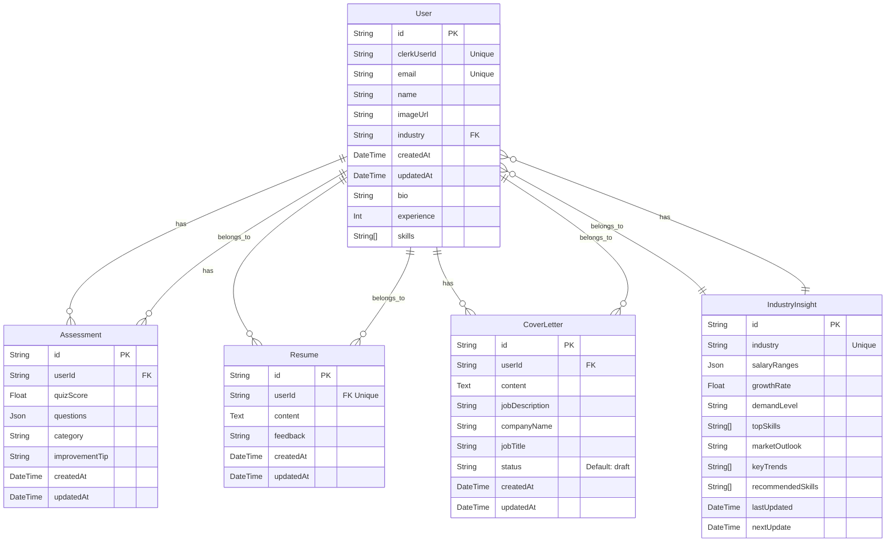

# 🚀 SenseAi – Your AI-Powered Career Assistant  

SenseAi is an AI-driven career advancement platform designed to help professionals **gain industry insights, build resumes, generate cover letters, and prepare for interviews** – all powered by cutting-edge AI.  

🌐 **Try it live**: [Sense AI](https://sense-ai-five.vercel.app/)


## ✨ Features  

🔹 **AI Industry Insights** – Get weekly industry reports tailored to your skills and experience.  
🔹 **Resume Builder** – Create, preview, and edit your resume in Markdown, then export it as a PDF.  
🔹 **AI Cover Letter Generator** – Generate personalized cover letters based on your job applications.  
🔹 **AI-Powered Interview Prep** – Practice with AI-generated MCQs and receive **performance reports** with improvement suggestions.  
🔹 **Automated Weekly Insights** – Industry insights are generated weekly using **Inngest cron jobs**.  

## 🛠️ Tech Stack  

| **Category**      | **Technology**  |
|------------------|---------------|
| **Frontend**     | Next.js, React, ShadCN UI |
| **Backend**      | Prisma ORM, Neon PostgreSQL |
| **Authentication** | Clerk |
| **Form Validation** | Zod |
| **AI**          | Gemini API |
| **Automation**  | Inngest (cron jobs) |

## Schema



## 🚀 Getting Started  

1️⃣ **Clone the repository:**  
   ```sh
   git clone https://github.com/yourusername/senseai.git
   cd senseai
```

2️⃣ **Install dependencies:**
   ```sh
npm install
```

3️⃣ **Set up environment variables:**
Create a .env file and add  following API keys:
 ```sh

NEXT_PUBLIC_CLERK_PUBLISHABLE_KEY=
CLERK_SECRET_KEY=
NEXT_PUBLIC_CLERK_SIGN_IN_URL=/sign-in
NEXT_PUBLIC_CLERK_SIGN_UP_URL=/sign-up
NEXT_PUBLIC_CLERK_AFTER_SIGN_IN_URL=/onboarding
NEXT_PUBLIC_CLERK_AFTER_SIGN_UP_URL=/onboarding

DATABASE_URL=

GEMINI_API_KEY=
```
4️⃣ **Run the development server:**
```sh
  npm run dev
```


## 🤝 Contributing
Contributions are welcome! If you’d like to improve this project, feel free to submit an issue or a pull request.


